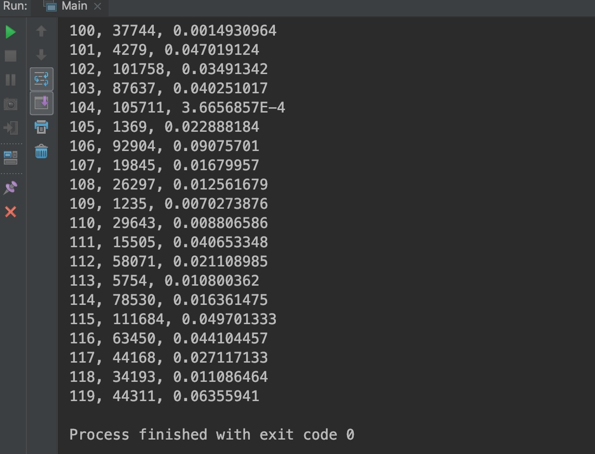
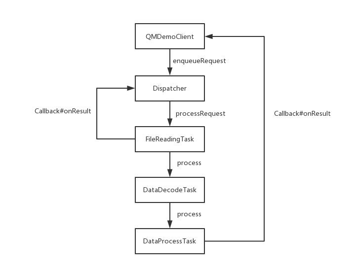
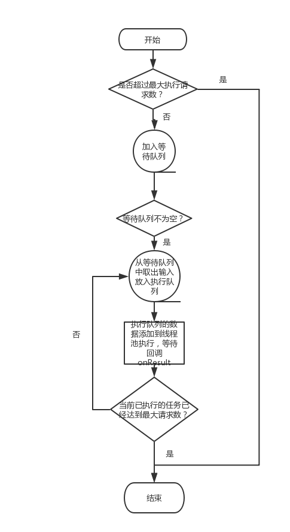
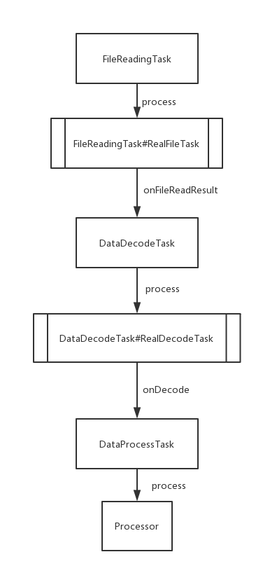
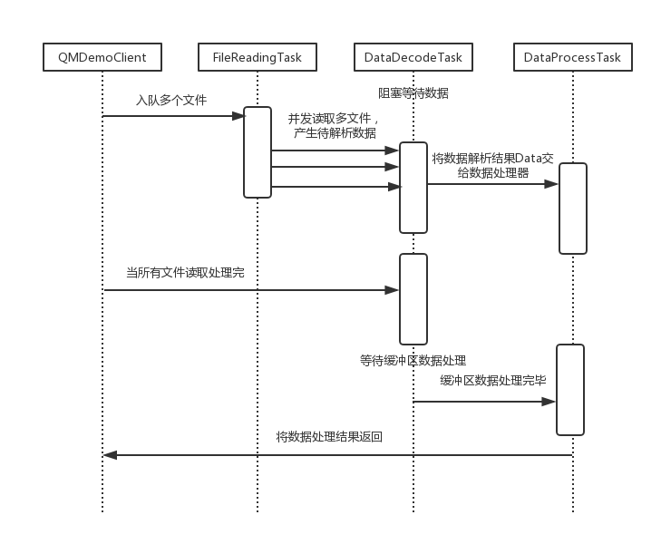
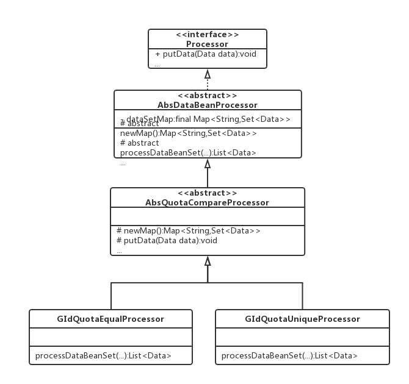

# QMTestDemo
QM测试的Demo，取名QMUtil。

# 一、题目

假设本地有一个文件夹，文件夹下面有若干文件（文件数大于50小于100），文件的存储格式是文本格式（后缀名是.txt)，文件的大小每个文件不会超过100k。

### 文件格式如下

2000102，100，98.32000103，101，73.32000104，102，98.32000105，100，101.32000106，101，45.3......

### 文件格式说明

文件每行都由三列构成，第一列是一个id，第二列是分组groupId, 第三列是指标quota。
id的数据类型是String, groupId的数据类型String, quota的数据类型float。

## 功能要求

1.把所有文件里面的内容按照分组进行排序，输出所有文件按照分组升序排序之后，每个分组下面的最小指标值。比如上面的数据输出结果为：

100，2000102，98.3101，2000106，45.3102，2000104，98.3

## 非功能要求

1. 文件读取要由线程池来执行，线程池的大小固定为8，文件内容需要存储到指定的内容数据结构当中。
2. 查找要求有独立线程来执行，直接消费读取线程池产生的内存数据结构。
3. 文件读取和排序要求并发作业，文件读取只要产生了数据，就可以把数据交给排序线程进行消费，计算最小值。

## 代码要求

1. 从上面的要求语意里面抽象出合适的设计模式。
2. 需要考虑多线程的并发控制，同步机制。
3. 代码实现只能用JDK1.6或者1.8自带的工具类

# 二、Demo运行说明

## 建议环境

IDE: IntelliJ IDEA 2018.1.4
JDK: 1.8.0

## 导入方式

使用IDEA菜单栏中的 "File" - "Open" - 找到QMTestDemo目录，打开即可。

## 测试数据生成

可以利用QMDemo Module的`test`包下面的`MakeFilesUtils`生成测试文件，测试文件生成路径在根目录的data文件夹。
测试文件配置信息可以在`qmutil`包下面的`Config`中修改。

> 注意：每次生成测试文件会情况已经存在的测试文件。

## 运行

执行`test`包下面的`Main`类的`main()`方法即可。

## 运行效果图



# 三、QMUtil技术文档

QMUtil是一个专门用于处理如下格式文件的工具包：

```
13020, 119, 108.95807
13021, 117, 10.987624
13022, 116, 19.01021
13023, 118, 37.725754
13024, 111, 76.12931
13025, 113, 132.62029
13026, 104, 31.974792
13027, 110, 66.039566
13028, 118, 140.2657
13029, 104, 59.611935
13030, 118, 18.539017
```

## 使用

使用分为以下几个步骤：

1).导入qmutil工具包

2).构建QMDemoClient
```java
QMDemoClient qmDemoClient = new QMDemoClient.Builder()
                    .setMaxRequest(100)//最大请求数设置为100
                    .setPoolSize(8)//用于处理请求的线程池大小设置为8
                    .setProcessor(new GIdQuotaUniqueProcessor())//设置数据处理器为GIdQuotaUniqueProcessor
                    .setResultCallBack(data -> {
                        //所有数据处理完后，在这里获取到处理结果
                    })//设置结果回调
                    .build();
```

3).构建Request
```java
Request request = new Request(new File(Config.BASE_PATH + filePath));
```

4).将Request加入处理队列
```java
qmDemoClient.enqueueRequest(request);
```
5).在Callback中处理回调数据

## 数据处理器

QMUtil提供了两个数据处理器，分别如下：

| Processor | 作用 |
| --- | --- |
| GIdQuotaUniqueProcessor | groupId分组排序，只缓存出现的第一个该分组Quota最小记录 |
| GIdQuotaEqualProcessor | groupId分组排序，会将同分组的所有Quota相等的记录缓存下来 |


# 四、技术说明

## 几个概念

- Bean：在这个Demo中被当做是内部的数据类型处理的数据结构。
- Request：一种请求的封装，对外暴露，用户在使用QMUtil进行文件处理时需要构建一个Request。
- Callback：一种通用的回调接口。
- Processor：可以处理内部数据类型的数据处理器，如实现排序，规整数据功能。
- Task：Demo中的任务，由责任链构成，每一个任务只关心他自己的职责。
- Dispatcher：任务分发器，用于协调线程池、等待请求队列、正在执行请求队列。

### 数据流

数据流简化的可视化流程如下：



### Dispatcher分发器

Dispatcher简化流程如下：



### Task

QMUtil中有FileReadingTask、DataDecodeTask、DataProcessTask这三种类型的Task，这里采用责任链模式设计，其说明如下：

- FileReadingTask：将File文件读取为行字符串。
- DataDecodeTask：将行字符串解析为内置Data数据类型。
- DataProcessTask：将Data数据进行组装，排序，规整。

> 其中，FileReadingTask是并发读文件，最多8个文件同时读取，DataDecodeTask有个独立线程处理读取到的文件，FileReadingTask与DataDecodeTask是生产者和消费者的关系。

三者流程如下：



数据处理时序图如下：



### Processor数据处理器

数据处理器采取简单模板方法模式（排序实现如果采用策略模式注入会更合理，时间问题简单处理这块），UML图如下：




